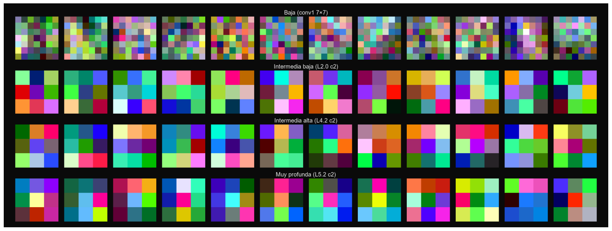

# 🐾 ResNet-101: Clasificación de Gato vs Perro con Interpretabilidad


Este proyecto implementa **ResNet-101** para clasificar imágenes de **gatos** y **perros**, con un módulo de **interpretabilidad** (Grad-CAM/LayerCAM) que permite visualizar qué zonas de la imagen influyen en la predicción. Este  proyecto está orientado a un **caso de uso de negocio en el sector veterinario** y a la interpretacion de arquitecturas de redes neuronales densas.

---

## 🚩 Problema de negocio
Las **veterinarias y clínicas de mascotas** reciben diariamente una gran cantidad de imágenes enviadas por clientes (por ejemplo, a través de **WhatsApp Business** o aplicaciones propias). Sin un sistema automatizado:
- El **equipo administrativo pierde tiempo** revisando y clasificando manualmente las fotos.
- No existe una **base de datos segmentada** de clientes según especie, lo que limita las campañas de marketing.
- Los veterinarios **no cuentan con trazabilidad visual** de lo que motivó la consulta inicial.

---

## 🎯 Propuesta de valor
- **Automatización de la clasificación**: cada foto recibida se etiqueta automáticamente como “gato” o “perro” en segundos.
- **Segmentación de clientes**: permite construir audiencias (dueños de gatos, dueños de perros, clientes mixtos) para **campañas de fidelización** o **programas de prevención diferenciados**.
- **Atención más ágil**: la IA filtra y organiza los casos, liberando tiempo del personal para lo realmente importante: la atención veterinaria.

---

## 🔍 Objetivos

- **Clasificación binaria** (cat vs dog) sobre imágenes del usuario (archivo local o URL).
- **Interpretabilidad avanzada** para inspeccionar la decisión del modelo en cada imagen:
  - **Occlusion Sensitivity**: relevancia por parches.
  - **Integrated Gradients**: atribuciones acumuladas desde una referencia.
  - **Grad-CAM**: mapa de calor clase-específico.
  - **Feature Maps (depth)**: activaciones intermedias por capa.
  - **Kernels (depth)**: filtros aprendidos (p. ej., Conv1).

---

## 🧩 Componentes principales

- **`resnet101/`**: implementación del modelo (desde cero) y artefactos de experimentos.
  - `src/` – arquitectura, bloques residuales, utilidades de guardado.
  - `model_trained/` – pesos entrenados.
  - `experiments/` – resultados y paneles generados.

- **`src/`**: API de inferencia (FastAPI) y utilidades.
  - `api/` – routers (`/health`, `/predict`, `/predict/advanced`), errores, middleware, deps.
  - `inference/` – pipeline de preprocesamiento → forward → postprocesado → validación.
  - `schemas/` – contratos Pydantic v2 para requests/responses (incluye metadatos e imágenes base64).
  - `utils/` – configuración, lectura de variables de entorno, paths, etc.
  - `tests/` – pruebas de contrato y validaciones de entrada (pytest).

- **`app/`**: interfaz de usuario (Streamlit) para subir imágenes/URLs y explorar explicaciones.

- **`data/`**: preparación de datos y estadísticas.
  - `processed/` – carpeta de trabajo (no versionar datos brutos).
  - `pet_stats.json` – medias/desviaciones para normalización reproducible.

- **`notebooks/`**: verificación de flujo de datos y sanity checks del modelo.

- **`oxford_pets_binary_resnet101.yaml`**: configuración del experimento (datos, modelo, optimizador, scheduler, device).


---

## 🔐 Pesos y datos

- Los **pesos del modelo** deben descargarse en [**MODELO**](https://drive.google.com/file/d/1j_MgSHO_bTxhc_Z8Zxt5rJXQJOEIzXuE/view?usp=sharing) y ser colocados en la siguiente ruta **`resnet101/model_trained`**
- Los **datos** deben respetar sus licencias; este proyecto usa **Oxford-IIIT Pet** con fines educativos.


---

## 🖼️ Showcase 

**Vista general de la App (Home / Subida de imagen):**  

<div align="center">
  
</div>

---

**Predicción avanzada (Interpretabilidad por método):**

<!-- 1) Grad-CAM centrado solo -->
<div align="center">
  <strong>Grad-CAM</strong><br>
  <br>
  <sub>Mapa de calor clase-específico.</sub>
</div>

---

<!-- 2) Fila: Occlusion | Integrated, ambos centrados -->
<div align="center">
  <table>
    <tr>
      <td align="center" style="padding:12px;">
        <strong>Occlusion Sensitivity</strong><br>
        <br>
        <sub>Importancia local al ocultar parches.</sub>
      </td>
      <td align="center" style="padding:12px;">
        <strong>Integrated Gradients (overlay)</strong><br>
        <br>
        <sub>Atribuciones acumuladas superpuestas.</sub>
      </td>
    </tr>
  </table>
</div>

---

<!-- 3) Feature Maps centrado -->
<div align="center">
  <strong>Feature Maps (profundidad/capas)</strong><br>
  <br>
</div>

<!-- 4) Kernels centrado -->
<div align="center" style="padding-top:8px;">
  <strong>Kernels (filtros aprendidos)</strong><br>
  <br>
  <sub>Filtros de capas tempranas (bordes, texturas, orientaciones).</sub>
</div>


---

## 🔧 Instalación y ejecución

> Requisitos mínimos: **Python 3.11+** (si vas con Poetry), **Git**.  
> Alternativa recomendada: **Docker** + **Docker Compose** (no necesitas Python ni Poetry en tu máquina).

### 1) Clonar el repo

```bash
git clone <URL_DEL_REPO>
cd <CARPETA_DEL_PROYECTO>
```

### 2) Pesos del modelo

Coloca el archivo de pesos (ej. `ResNet101.pth`) en: resnet101/model_trained/

---

## Opción A — Ejecutar con Poetry (local)

> Útil para desarrollo rápido sin contenedores.

1) Instala dependencias y activa el venv:

```bash
poetry install
```

2) (Opcional) Variable de entorno para que Streamlit consuma otra API:

```bash
# PowerShell
$env:API_BASE_URL="http://127.0.0.1:8000"

# Bash
export API_BASE_URL="http://127.0.0.1:8000"
```

3) Abre **dos consolas** en la raíz del proyecto:

**Consola 1 — API (FastAPI/Uvicorn)**  

```bash
poetry run uvicorn src.api.main:app --host 0.0.0.0 --port 8000 --reload
```

**Consola 2 — UI (Streamlit)**  
```bash
poetry run streamlit run app/app.py
```

- API docs: http://localhost:8000/docs  
- UI: http://localhost:8501  

---

## Opción B — Ejecutar con Docker / Docker Compose (recomendado)

> Levanta **API** y **UI** en contenedores separados con un solo comando.

### B.1 Construir la imagen (si aún no existe)

```bash
docker build -t mi_app:latest_final .
```

### B.2 Usar `docker-compose.yml`

```bash
docker compose up -d
```

- API: http://localhost:8000/docs  
- UI:  http://localhost:8501  

### B.3 Comandos útiles

```bash
# Levantar en segundo plano
docker compose up -d

# Ver logs (API / UI)
docker compose logs -f api
docker compose logs -f ui

# Reiniciar tras cambios en código
docker compose up -d --build

# Apagar y limpiar contenedores
docker compose down
```


### 🛠️ Problemas comunes

- **Pesos no encontrados**: verifica la ruta `resnet101/model_trained/ResNet101.pth`.
- **CORS / conexión App–API**: confirma `API_BASE_URL` y que Uvicorn está en `127.0.0.1:8000`.
- **Dependencias**: vuelve a instalar con `poetry install` o actualiza con `poetry update`.


---

## 🗺️ Rutas expuestas (API)

- `GET /health` → Estado del servicio.
- `POST /predict` → Predicción base: `label`, `scores`, `meta`.
- `POST /predict/advanced` → Predicción + `artifacts` de interpretabilidad.


---

## 🔍 Flujo de inferencia

1. **Entrada**: archivo o URL → validación (MIME/shape).
2. **Preprocesamiento**: resize/center-crop → tensor normalizado (estadísticos cacheados).
3. **Modelo (ResNet-101)**: forward → logits → softmax.
4. **Salida básica**: `label` + `scores` + `meta`.
5. **Salida avanzada**: añade `artifacts` con paneles (PNG base64) para:
   - `gradcam_panel`
   - `integrated_gradients_overlay`
   - `occlusion_overlay`
   - `feature_maps_panel`
   - `kernels_panel`
   (e indicadores de error por panel si aplica.)

---

## 📊 Métricas de referencia (validación)

<div align="center">

<p><em>Resumen</em></p>

<table>
  <thead>
    <tr>
      <th>Métrica</th>
      <th>Valor</th>
    </tr>
  </thead>
  <tbody>
    <tr>
      <td>Val Loss</td>
      <td><strong>0.4084</strong></td>
    </tr>
    <tr>
      <td>ROC-AUC</td>
      <td><strong>0.9108</strong></td>
    </tr>
  </tbody>
</table>

<br/>

<p><em>Reporte de clasificación</em></p>

<table>
  <thead>
    <tr>
      <th>Clase</th>
      <th>Precisión</th>
      <th>Recall</th>
      <th>F1-Score</th>
      <th>Soporte</th>
    </tr>
  </thead>
  <tbody>
    <tr>
      <td>0 (gato)</td>
      <td>0.6840</td>
      <td>0.8750</td>
      <td>0.7678</td>
      <td>240</td>
    </tr>
    <tr>
      <td>1 (perro)</td>
      <td>0.9301</td>
      <td>0.8044</td>
      <td>0.8627</td>
      <td>496</td>
    </tr>
    <tr>
      <td><strong>Exactitud</strong></td>
      <td></td>
      <td></td>
      <td><strong>0.8274</strong></td>
      <td>736</td>
    </tr>
    <tr>
      <td><strong>Macro Avg</strong></td>
      <td>0.8071</td>
      <td>0.8397</td>
      <td>0.8153</td>
      <td>736</td>
    </tr>
    <tr>
      <td><strong>Ponderado</strong></td>
      <td>0.8498</td>
      <td>0.8274</td>
      <td>0.8318</td>
      <td>736</td>
    </tr>
  </tbody>
</table>

</div>


---

## ⚙️ Reproducibilidad

- Configuración centralizada en **YAML** (dataset, normalización, arquitectura, optimizador, scheduler).
- Estadísticos de normalización cacheados en `data/pet_stats.json`.
- Semillas y dispositivos controlados (CPU/CUDA).


---

## 📄 Licencia y créditos

- Uso **educativo y de investigación**.
- Cita sugerida a **He et al. (2015)** por ResNet y a los trabajos originales de interpretabilidad correspondientes.
- Agradecimientos a la comunidad PyTorch y al dataset Oxford-IIIT Pet.

---

## 📬 Contacto

- Issues y mejoras: usar el **Issue Tracker** del repositorio.
- Preguntas técnicas: abrir un **Discussion** con el tag `help-wanted`.
